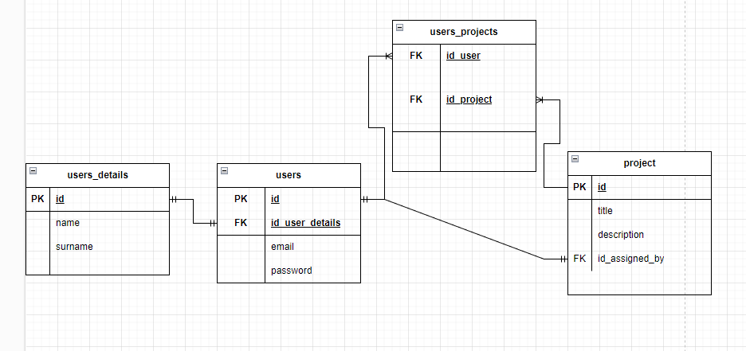

# TIPSY TASK

FUNKCJONALNOŚCI:

-rejestracja

-logowanie

-dodawanie kart

-gra

-szukanie kart

DIAGRAM UML KLAS:

DIAGRAM ERD BAZY:

PRZYKŁAD DZIAŁANIA:  

logowanie:

Po wejściu na stronę główną mamy możlowość zalogowania lub rejestracji.

rejestracja:

strona główna:

Na stronie głównej mamy wybór : gry, przeczytania zasad, dodania karty, przeglądania kart.

Gra:

Wykonujemy zadanie na karcie, wybieramy następną lub wracamy do strony głównej.

Dodawanie karty:

Dodajemy zdjęcie z tyułem oraz opisem.

Przeglądanie kart:

Wyszukiwanie kart

WZORCE PROJEKTOWE:

-MVC:

W projekcie, który wykorzystuje wzorzec Model-View-Controller (MVC), modele pełnią kluczową rolę w reprezentacji danych aplikacji. Umieszczając modele w folderze "src/models", oddzielamy je jako osobne komponenty, które są odpowiedzialne za strukturę danych i definicję informacji.

Modele w folderze "src/models" są obiektami, które służą do reprezentacji struktury danych aplikacji. Odpowiadają za określanie właściwości i zachowań tych danych, niezależnie od logiki biznesowej. Jeśli logika biznesowa jest wyodrębniona do repozytorium, modele skupiają się głównie na reprezentacji danych i nie zawierają logiki.

W folderze "src/repository" znajduje się specjalny komponent nazywany repozytorium, który ma za zadanie obsługiwać logikę biznesową aplikacji. Repozytorium pełni trzy główne funkcje: pobieranie danych, przetwarzanie ich oraz zapisywanie. Do reprezentacji tych danych używa modeli, które pełnią rolę struktur danych.
Kontrolery, które znajdują się w folderze "src/controllers", pełnią rolę obsługi żądań użytkownika oraz komunikacji między repozytorium a widokami. Główne zadanie kontrolerów polega na pobieraniu danych z repozytorium za pomocą odpowiednich metod i następnie przekazywaniu ich do widoków w celu wyświetlenia.
W folderze "public/views" znajdują się pliki, które są odpowiedzialne za prezentację danych użytkownikowi. Te pliki, nazywane widokami, mają za zadanie wyświetlać dane w sposób czytelny i atrakcyjny. Aby to osiągnąć, widoki korzystają z modeli, które dostarczają struktury danych.

Kontrolery, które są odpowiedzialne za obsługę żądań użytkownika, współpracują z repozytorium w celu pobrania odpowiednich danych. Następnie, te dane są przekazywane do odpowiednich widoków, które są odpowiedzialne za ich prezentację użytkownikowi. Widoki wykorzystują modele do dostosowania wyglądu i układu danych, aby zapewnić czytelność i atrakcyjność prezentowanych informacji.

Podsumowując,  W projekcie opartym na wzorcu Model-View-Controller (MVC), każda z głównych komponentów pełni określoną rolę. Modele w folderze "src/models" reprezentują strukturę danych aplikacji, zawierając informacje o właściwościach i zachowaniach tych danych. Repozytorium w folderze "src/repository" odpowiada za obsługę logiki biznesowej, pobierając, przetwarzając i zapisując dane za pomocą modeli.

Kontrolery w folderze "src/controllers" są odpowiedzialne za obsługę interakcji między warstwą prezentacji a danymi. Pobierają dane z repozytorium i przekazują je do odpowiednich widoków w folderze "public/views" w celu prezentacji użytkownikowi. Widoki są odpowiedzialne za estetyczne i czytelne przedstawienie danych użytkownikowi, korzystając z modeli do wyświetlania informacji w atrakcyjny sposób.

Dzięki takiemu podziałowi odpowiedzialności i strukturze projektu opartej na MVC, kod aplikacji staje się bardziej zarządzalny. Różne aspekty aplikacji, takie jak struktura danych, logika biznesowa, obsługa interakcji i prezentacja, są oddzielone i mają swoje własne miejsce w odpowiednich folderach. To umożliwia łatwiejsze zrozumienie i rozwijanie aplikacji, a także ułatwia współpracę między członkami zespołu programistyczneg.

-Dependency Injection:

Wstrzykiwanie zależności (DI) to technika, która polega na przekazywaniu obiektów wymaganych przez daną klasę zamiast tworzenia ich bezpośrednio wewnątrz klasy. Dzięki zastosowaniu DI, klasy nie muszą martwić się o to, jak ich zależności są tworzone lub zaimplementowane, co prowadzi do luźnego powiązania i większej elastyczności w projektowaniu aplikacji.

W tym przypadku, struktura katalogowa "src/controllers", "src/models" i "src/repository" może korzystać z kontenera DI do zarządzania zależnościami. Kontener DI, taki jak popularne biblioteki czy frameworki, umożliwia łatwe skonfigurowanie i dostarczenie potrzebnych zależności dla klas w aplikacji. Dzięki temu można łatwo wymieniać implementacje poszczególnych komponentów i testować je niezależnie, dostarczając odpowiednie zależności w kontekście testowym.

Korzystanie z DI w tym projekcie ma wiele korzyści. Po pierwsze, zapewnia większą modularność, skalowalność i testowalność kodu. Poprzez oddzielenie tworzenia zależności od samego kodu, możemy łatwo wprowadzać zmiany w implementacji poszczególnych komponentów. Ponadto, dzięki DI można łatwo testować poszczególne komponenty, dostarczając im zależności w kontrolowany sposób w czasie testów.

Wniosek jest taki, że wykorzystanie wstrzykiwania zależności (DI) przynosi wiele korzyści, takich jak luźne powiązania, elastyczność, modularność i łatwość testowania. Pozwala również na łatwe wprowadzanie zmian w implementacji komponentów oraz minimalizuje wpływ tych zmian na inne części aplikacji, ponieważ konfiguracja zależności odbywa się na poziomie kontenera DI, a nie w samym kodzie.

-Repository Pettern:

Folder "src/repository" w tej aplikacji wykorzystuje kolejny wzorzec projektowy, który nazywa się wzorcem Repository. Ten wzorzec umożliwia separację logiki dostępu do danych od pozostałych części aplikacji w kontekście wzorca Model-View-Controller (MVC). Repozytorium zawarte w tym folderze odpowiada za obsługę operacji CRUD (Create, Read, Update, Delete) na danych przechowywanych w bazie danych.

Głównym celem wzorca Repository jest zapewnienie jednolitego interfejsu do manipulacji danymi, niezależnie od źródła danych, bez konieczności bezpośredniego kontaktu z bazą danych. Repozytorium działa jako pośrednik między resztą aplikacji a bazą danych, dostarczając metody i funkcje, które umożliwiają operacje na danych.

Dzięki zastosowaniu wzorca Repository możemy łatwo zarządzać danymi i zachować elastyczność w przypadku zmian w źródle danych. W przypadku ewentualnych zmian w bazie danych, np. zmiana silnika bazy danych lub dodanie nowego źródła danych, nie musimy modyfikować pozostałych części aplikacji. Repozytorium dostarcza jednolity interfejs, co umożliwia bezproblemową adaptację do nowych warunków, jednocześnie zachowując separację logiki dostępu do danych od pozostałych komponentów aplikacji w kontekście wzorca MVC.

-Front Controller:

W pliku index.php, po rozpoczęciu sesji, dokonuje się parsowanie ścieżki z żądania HTTP. Do tego celu wykorzystywana jest klasa Router, która definiuje mapowanie ścieżek żądań na konkretne kontrolery.

Przykładowo, żądania typu POST o pustej ścieżce są obsługiwane przez kontroler DefaultController, żądania o ścieżce "login" są obsługiwane przez kontroler SecurityController, a żądania o ścieżce "addProject" i "projects" są obsługiwane przez kontroler ProjectController.

Wszystkie te mapowania ścieżek są zdefiniowane w Routerze. Następnie, po zdefiniowaniu mapowania, wywoływana jest metoda run() na Routerze, przekazując zparsowaną ścieżkę z żądania jako parametr. To powoduje obsługę żądania przez odpowiedni kontroler na podstawie mapowania.

Dzięki zastosowaniu wzorca Front Controller w pliku index.php, wszystkie żądania są skierowane do jednego centralnego punktu wejścia. Jest to korzystne, ponieważ ułatwia zarządzanie i routowanie żądaniami w aplikacji. Dzięki temu, każde żądanie jest przekierowywane do odpowiedniego kontrolera na podstawie zdefiniowanych mapowań, co umożliwia jednolite zarządzanie żądaniami w całej aplikacji.

-Singleton:

W klasie Database.php wykorzystywany jest wzorzec Singleton, który umożliwia utworzenie jednej unikalnej instancji (singleton) do zarządzania połączeniem z bazą danych.

Klasa Database.php zapewnia tylko jedną instancję połączenia z bazą danych, co eliminuje potrzebę tworzenia wielu instancji tego samego połączenia i oszczędza zasoby systemowe. Wzorzec Singleton jest używany w celu zapewnienia globalnego dostępu do tej jednej instancji w różnych miejscach aplikacji.

Na przykład, w klasie Database.php istnieje statyczna metoda getInstance(), która zwraca instancję klasy Database. Jeśli instancja już istnieje, jest ona zwracana, a w przeciwnym razie tworzona jest nowa instancja.

Dzięki wykorzystaniu wzorca Singleton można uniknąć tworzenia zbędnych instancji połączenia z bazą danych i zagwarantować, że wszystkie komponenty aplikacji korzystają z tego samego połączenia. To z kolei przyczynia się do oszczędności zasobów i utrzymania spójności połączenia w całej aplikacji.

Rozwijanie projektu:
-dodatkowe zabezpieczenia
-dodanie opcji usunięcia konta
-dodanie możliwość gry bez towrzenia konta...
