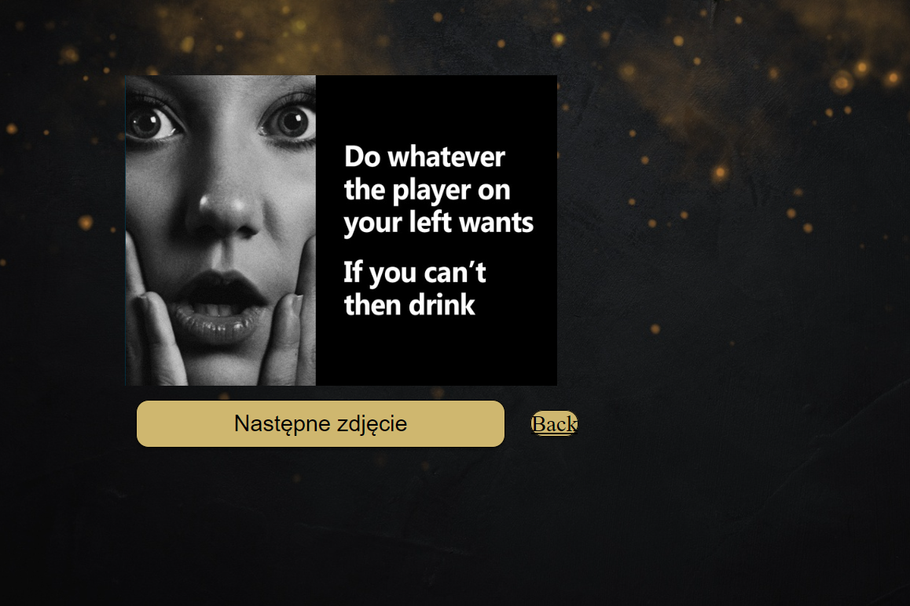
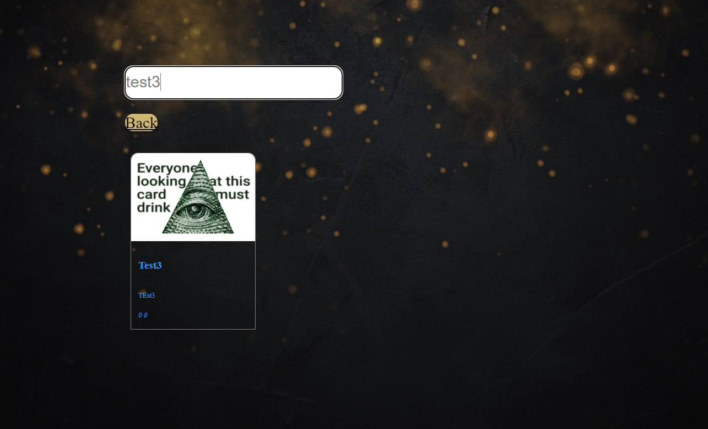

# TIPSY TASK

FUNKCJONALNOŚCI:

-rejestracja

-logowanie

-dodawanie kart

-gra

-szukanie kart

DIAGRAM ERD BAZY:

PRZYKŁAD DZIAŁANIA:  

logowanie:

Po wejściu na stronę główną mamy możlowość zalogowania lub rejestracji.

rejestracja:

strona główna:

Na stronie głównej mamy wybór : gry, przeczytania zasad, dodania karty, przeglądania kart.

Gra:

Wykonujemy zadanie na karcie, wybieramy następną lub wracamy do strony głównej.

Dodawanie karty:

Dodajemy zdjęcie z tyułem oraz opisem.

Przeglądanie kart:

Wyszukiwanie kart

